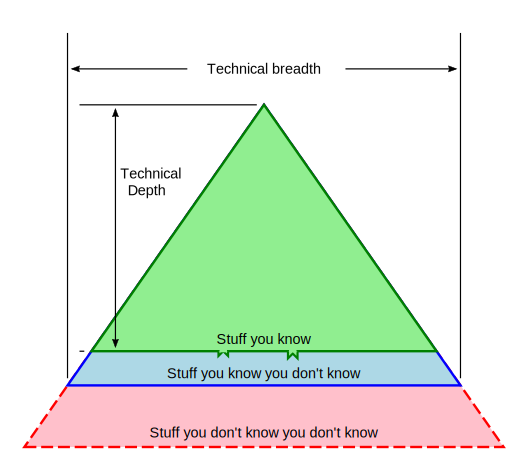
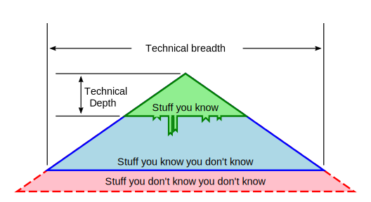

# Technical Triangles

In Chapter 2 of Richards & Ford [Fundamentals of Software Architecture](https://www.goodreads.com/book/show/44144493-fundamentals-of-software-architecture) the authors present an interesting characterization of technical knowledge encoding Rumsfeld's notions of what is and is not known.

It's important to understand that this and the following diagrams are subjective
and qualitative, best used for thinking aids and discussion tools.

## Degrees of experience

How does one know what one knows? How do we characterize our knowledge?
Is there an epistemic justification for classifying our personal knowledge?

1. **Heard about**: the subject is something which has come up in disucssion,
  or you have seen mentioned tangentially in an article. You can classify or
  categorize the subject matter. For example, dtb is something to do with data
  engineering.
1. **Read About**: directed reading on the subject to some depth, focused attention
  on the subject. You are able to ask intelligent questions about the subject.
1. **Wrote about**: blog post, summary article which is well-referenced.
  You know who the person or the company responsible for or driving development.
1. **Took a class**: the subject was one of the primary topics of the class.
1. **Toy implementation**: a running example. Even a small example usually
  exposes the main concept of the subject.
1. **Implemented once for production**: might have been, and probably was, years ago.
  With some time, you can relearn and reimplement, you have experienced the major
  pitfalls.
1. **Multiple production implementations**: Not only major pitfalls, but have dealt
  with both usual and unusual edge cases.
1. **Can debug running instances**: you have or have had extensive day to day experience
  with the subject.
1. **Implementation contributor** your pull requests are merged into releaed subject.
1. **Core maintainer or subject founder** You are Linus, Bjarne, Ken, Matz, Rich, Guido,
   or have release privileges for the subject.

## Depth-focused engineer

Trading breadth for extreme depth results in the following:

This is a good characterization for junior engineers, but also works at any level for an engineer who can maintain a depth-oriented career. The risk is going too deep into a deadend, or becoming an [Expert Beginner](https://daedtech.com/how-developers-stop-learning-rise-of-the-expert-beginner/)

## Breadth-focused engineer

This is a common situation for very senior engineers, particularly at the Staff+ or Software Architect level.
Over the course of decades the amount of technology someone "knows about" vastly exceeds the technology
someone is conversant with on a day to day basis.

## Implementation notes

As noted, the work was inspired by material from Chapter 2 of _Fundamentals of Software Architecture_.
Attempting to recreate similar diagrams with graphical tools such as Inkscape was
frustrating for the author. Lines and angles were very difficult to align. Hence the
following parametric implementation.

### Parameterization

This project was instigation by a confluence of factors, including:

1. desire to create an interesting talk
2. frustration using visual drawing tools (Inkscape) to create exactly what I wanted to see
3. An intermittent interest in SVG dating back at least 20 years

These factors were sufficient to inspire a scripting solution, to at least provide a workable base file which could be touched up or further modified by Inkscape or similar tools.

There are two types of parameters:

1. structural, which control the shape and relative thickness of layers, and
2. style which manages everything else.

The current implementation is parameterized using:

- `Scale`: an arbitrary value representing one half the base length. Image width is computed as a side effect.
- `Angle`: sets both interior isoceles angle to be the same, controls the height.
- `Fractions`: both lines for "you know you know" (green) and "you know you don't know" (blue) are controlled by a fractional value of  the scale parameter.

While `Angle` and `Fractions` are sensible, `Scale` is inconvenient and (at this time) needs to be reparameterized using the total width of the image.
 
### Component design

Software design is an aspect of architecture, a short discussion
on LCOM and coupling follows.

**Loose coupling** is widely discussed in the trade as a powerful
tool for increasing legibility of implementation by reducing
the cognitive load required for understanding. The implementation
is composed of 3 parts:

1. A set of three triangles superimposed one on another,
2. An arrowhead definition,
3. A banner definition.

Each of these may be independently rendered without regard
to the others. The banner is coupled only in terms of option
passed in for initialization. The arrowhead is coupled by
its role as an SVG-defined marker element. 

**LCOM - Lack of Cohesion of Methods** measures the extent of
which a class or component requires execution outside the
scope of the class or component. While the term "LCOM" is in
itself a bit clunky, the notion is useful.

In this project, all of the computation is internal to each class.
Adjustments to default parameter values are managed with optional arguments.
The only methods outside the components are language or library calls
for creating SVG, writing to files, etc.

### Testability

It may seem stupid or overtested, but having known good output to test
against has saved time particularly when refactoring for extension. Each component
as well as a triangle with a specific set of parameters is represented by
a "proof" copy. Testing with RSpec ensures any changes to the generation
procedure preservces known good output. Since each component has high
cohesion, test configuration is simple.

Each compoenent has a helper method for writing itself directly to a file as
an independent SVG file. While creates a bit of overhead for each class,
the alternative is comparing against strings defined in the test suite.
Comparing known good files seems easier to maintain than strings used for
comparison testing, the details are hidden.
